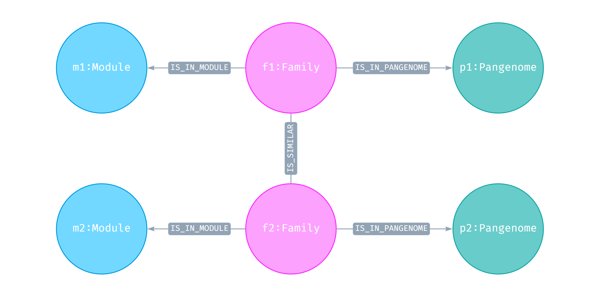

# IQD - TP sur Neo4j et Cypher

- Eldar Kasmamytov p1712650

## Naviguer la structure du graphe
---

### 1) Les noms de toutes les étiquettes distinctes associées aux nœuds

```cypher
CALL db.labels()
```

Ou

```cypher
MATCH (n) RETURN DISTINCT labels(n) as Labels
```

### 2) Les noms de toutes les étiquettes distinctes associées aux arêtes

```cypher
CALL db.relationshipTypes()
```

Ou

```cypher
MATCH (a)-[r]-(b) RETURN DISTINCT type(r) as Relations
```

### 3) Les propriétés associées

#### Pour les **Nœuds**:

```cypher
MATCH (n) 
WITH labels(n) AS labels, keys(n) AS keys
UNWIND labels AS label
UNWIND keys AS key
RETURN DISTINCT label, collect(DISTINCT key) AS properties
ORDER BY label
```

#### Pour les **Relations**:

```cypher
MATCH ()-[r]-()
RETURN DISTINCT type(r) as Relation, keys(r) as Keys
ORDER BY Relation
```

### 4) La représentation sous forme de diagramme

> Dans Neo4j, il est également possible de visualiser le schema du graphe avec la commande suivante: `CALL db.schema.visualization()`

Le diagramme créé avec l'outil [Arrows.App](https://arrows.app):


## Les requêtes intra-pangenomiques
---

### Requête 1

```cypher
MATCH (pg:Pangenome)<-[:IS_IN_PANGENOME]-(f:Family)
WHERE f.annotation IS NOT null
RETURN pg.name as Nom, count(f) as Count
```

|Nom                    |Count|
|-----------------------|-----|
|Enterobacter.cloacae   |110  |
|Acinetobacter.baumannii|92   |

### Requête 2

```cypher
MATCH (pg:Pangenome)<-[:IS_IN_PANGENOME]-(f:Family)-[:HAS_PARTITION]->(p:Partition)
WHERE f.annotation IS NOT null AND p.partition IN ['cloud', 'shell']
RETURN pg.name as Nom, count(f) as Count
```

|Nom                      |Count|
|-------------------------|-----|
|"Acinetobacter.baumannii"|77   |
|"Enterobacter.cloacae"   |88   |

### Requête 3

```cypher
MATCH (s:Spot)<-[:IS_IN_SPOT]-(n:RGP)
MATCH (n)<-[:IS_IN_RGP]-(:Gene)-[:IS_IN_FAMILY]->(f:Family)
WHERE f.annotation IS NOT null
RETURN n.name as Nom, count(n.name) as Count, s.name as Hotspot
```

Cette requête retourne *1376* tuples, dont les 3 premiers vous sont donnés ci-dessous:

|Nom                  |Count|Hotspot|
|---------------------|-----|-------|
|UGJB01000004.1_RGP_38|2    |246    |
|CP040827.1_RGP_0     |15   |52     |
|CP020089.1_RGP_0     |1    |135    |
| ... | ... | ... |

### Requête 4

```cypher
MATCH (pg:Pangenome)<-[:IS_IN_PANGENOME]-(:Family)<-[:IS_IN_FAMILY]-(:Gene)-[:IS_IN_RGP]->(rgp:RGP)
WITH pg, count(rgp) as cnt
RETURN pg.name as Nom, cnt as Count
ORDER BY cnt DESC
LIMIT 2
```

|Nom                      |Count|
|-------------------------|-----|
|"Acinetobacter.baumannii"|307  |
|"Enterobacter.cloacae"   |304  |

### Requête 5

```cypher
MATCH (pg:Pangenome)<-[:IS_IN_PANGENOME]-(f:Family)<-[:IS_IN_FAMILY]-(g:Gene)
MATCH (f)-[:IS_IN_MODULE]->(:Module)
WITH pg, count(g) as cnt
RETURN pg.name as Nom, cnt as Count
ORDER BY cnt DESC
LIMIT 2
```

|Nom                      |Count |
|-------------------------|------|
|"Acinetobacter.baumannii"|130718|
|"Enterobacter.cloacae"   |51161 |

### Requête 6

```cypher
MATCH (pg:Pangenome)<-[:IS_IN_PANGENOME]-(:Family)-[:IS_IN_MODULE]->(m:Module)
WITH pg, count(m) as cnt
RETURN pg.name as Nom, cnt as Count
ORDER BY cnt DESC
LIMIT 2
```

|Nom                      |Count|
|-------------------------|-----|
|"Acinetobacter.baumannii"|3790 |
|"Enterobacter.cloacae"   |3404 |

## Les requêtes inter-pangenomiques
---

### Requête 1

```cypher
MATCH (pg:Pangenome)<-[:IS_IN_PANGENOME]-(:Family)-[:IS_SIMILAR]-(f:Family)-[:HAS_PARTITION]->(p:Partition)
RETURN DISTINCT pg.name as Species,
       f.name as Similar_Family,
       p.partition as Partition
ORDER BY Species
```

Retourne ***10 979* tuples**, dont les *3 premiers* vous sont affichés ci-dessous:

|Species                |Similar_Family|Partition |
|-----------------------|--------------|----------|
|Acinetobacter.baumannii|AXA63_RS14360 |persistent|
|Acinetobacter.baumannii|AB895_RS17625 |cloud     |
|Acinetobacter.baumannii|AUO97_RS01825 |shell     |
| ... | ... | ... |

### Requête 2

Inter-pangenomiques veut dire les familles `Family` qui sont dans des différents espèces `Pangenome` (p1 != p2). Ainsi, on cherche un sous-graph qui a l'air comme ça:


<p style="text-align: center;"><i>Le sous-graphe que l'on cherche</i></p>

```cypher
MATCH (f1:Family)-[:IS_SIMILAR]-(f2:Family)
WHERE f1<>f2
MATCH (p1:Pangenome)<-[:IS_IN_PANGENOME]-(f1)-[:IS_IN_MODULE]->(m1:Module)
MATCH (p2:Pangenome)<-[:IS_IN_PANGENOME]-(f2)-[:IS_IN_MODULE]->(m2:Module)
WHERE p1<>p2
RETURN f1.name as Family1,
       f2.name as Family2,
       count(f1.name) as Count1,
       count(f2.name) as Count2,
       m1.name as Module1,
       m2.name as Module2
ORDER BY Family1, Family2, Module1, Module2
```

Cette requête retourne ***90* tuples**, dont les *3 premiers* vous sont donnés ci-dessous:

|Family1        |Family2                 |Count1        |Count2        |Module1|Module2|
|---------------|------------------------|--------------|--------------|-------|-------|
|A388_RS01365   |GCA_002982195.1_CDS_0607|1             |1             |177    |40     |
|A388_RS01385   |GCA_002278355.1_CDS_3234|1             |1             |178    |246    |
|A388_RS18445   |GCA_013376815.1_CDS_5276|1             |1             |175    |53     |
| ... | ... | ... | ... | ... | ... |

L'attribut `Count` est toujours *1*, car chaque paire de nœuds de type **Family** est unique, cela peut être vérifié avec la requête suivante, qui ne retourne aucun résultat.

```cypher
MATCH (f1:Family)-[:IS_SIMILAR]-(f2:Family)
WITH f1, f2, count(*) as cnt
WHERE f1<>f2 AND cnt > 1
RETURN f1.name as Family1,
       f2.name as Family2,
       cnt as Count
ORDER BY cnt DESC
```

### Requête 3

```cypher
MATCH (f1:Family)-[:IS_SIMILAR]-(f2:Family)
WHERE f1<>f2
MATCH (f1)-[:IS_IN_PANGENOME]->(p1:Pangenome)
MATCH (f2)-[:IS_IN_PANGENOME]->(p2:Pangenome)
WHERE p1<>p2
MATCH (f)<-[:IS_IN_FAMILY]-(:Gene)-[:IS_IN_RGP]->(:RGP)-[:IS_IN_SPOT]->(:Spot)
WHERE f=f1 OR f=f2
RETURN DISTINCT f1.name as Family1, f2.name as Family2
ORDER BY Family1, Family2
```

La requête retourne ***722* tuples**, dont les *3 premiers* vous sont donnés ci-dessous:

|Family1                 |Family2                  |
|------------------------|-------------------------|
|A1S_2475                |GCA_012062485.1_CDS_4153 |
|A388_RS01365            |GCA_002982195.1_CDS_0607 |
|A388_RS01385            |GCA_002278355.1_CDS_3234 |
| ... | ... |

### Requête 4

```cypher
MATCH (f1:Family)-[r:IS_SIMILAR]-(f2:Family)
WHERE r.identity>0.8 AND r.coverage>0.8
MATCH (pg1:Pangenome)<-[:IS_IN_PANGENOME]-(f1)-[:HAS_PARTITION]->(p1:Partition)
MATCH (pg2:Pangenome)<-[:IS_IN_PANGENOME]-(f2)-[:HAS_PARTITION]->(p2:Partition)
RETURN pg1.name as Species1,
       pg2.name as Species2,
       p1.partition as Part1,
       p2.partition as Part2,
       f1.annotation as Annot1,
       f2.annotation as Annot2
ORDER BY r.identity, r.coverage DESC
LIMIT 1
```

La requête ne retourne **aucun résultat**. Ce comportement peut être expliqué par le fait qu'il n'existe aucun `identity` ou `coverage` supérieur à 0.8 (la valeur maximum pour ces propriétés est 0.8). **Avec des égalités autorisés**, on a *564* tuples, dont la 1ère est:

- Si on retourne les noms des **espèces** `Pangenome` :

|Species1                 |Species2              |Part1|Part2|Annot1|Annot2|
|-------------------------|----------------------|-----|-----|------|------|
|"Acinetobacter.baumannii"|"Enterobacter.cloacae"|shell|shell|TEM-1 |TEM-1 |

- Si on retourne les noms des **familles** `Family` :

|Family1      |Family2                 |Part1|Part2|Annot1|Annot2|
|-------------|------------------------|-----|-----|------|------|
|CTZ18_RS12990|GCA_001472555.1_CDS_4314|shell|shell|TEM-1 |TEM-1 |

## Analyse expérimentale
---

### 1)

```cypher

```

### 2)

```cypher

```

### 3)

```cypher

```