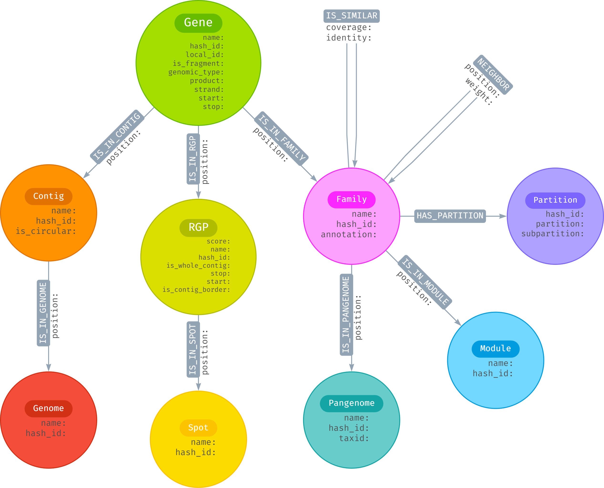

# IQD - TP sur Neo4j et Cypher

- Eldar Kasmamytov p1712650

## Naviguer la structure du graphe
---

### 1) Les noms de toutes les étiquettes distinctes associées aux nœuds

```cypher
CALL db.labels()
```

Ou

```cypher
MATCH (n) RETURN DISTINCT labels(n) as Labels
```

### 2) Les noms de toutes les étiquettes distinctes associées aux arêtes

```cypher
CALL db.relationshipTypes()
```

Ou

```cypher
MATCH (a)-[r]-(b) RETURN DISTINCT type(r) as Relations
```

### 3) Les propriétés associées

#### Pour les **Nœuds**:

```cypher
MATCH (n) 
WITH labels(n) AS labels, keys(n) AS keys
UNWIND labels AS label
UNWIND keys AS key
RETURN DISTINCT label, collect(DISTINCT key) AS properties
ORDER BY label
```

#### Pour les **Relations**:

```cypher
MATCH ()-[r]-()
RETURN DISTINCT type(r) as Relation, keys(r) as Keys
ORDER BY Relation
```

### 4) La représentation sous forme de diagramme

> Dans Neo4j, il est également possible de visualiser le schema du graphe avec la commande suivante: `CALL db.schema.visualization()`

Le diagramme créé avec l'outil [Arrows.App](https://arrows.app):





## Les requêtes intra-pangenomiques
---

### 1)

```cypher
MATCH (pg:Pangenome)<-[:IS_IN_PANGENOME]-(f:Family)
WHERE f.annotation IS NOT null
RETURN pg.name as Nom, count(f) as Count
```

|Nom                    |Count|
|-----------------------|-----|
|Enterobacter.cloacae   |110  |
|Acinetobacter.baumannii|92   |

### 2)

```cypher
MATCH (pg:Pangenome)<-[:IS_IN_PANGENOME]-(f:Family)-[:HAS_PARTITION]->(p:Partition)
WHERE f.annotation IS NOT null AND p.partition IN ['cloud', 'shell']
RETURN pg.name as Nom, count(f) as Count
```

|Nom                      |Count|
|-------------------------|-----|
|"Acinetobacter.baumannii"|77   |
|"Enterobacter.cloacae"   |88   |

### 3)

```cypher
MATCH (s:Spot)<-[:IS_IN_SPOT]-(n:RGP)<-[:IS_IN_RGP]-(g:Gene)-[:IS_IN_FAMILY]->(f:Family)
WHERE f.annotation IS NOT null
RETURN n.name as Nom, count(n.name) as Count, s.name as Hotspot
```

Cette requête retourne *1376* tuples, dont les 3 premiers vous sont donnés ci-dessous:

|Nom                  |Count|Hotspot|
|---------------------|-----|-------|
|UGJB01000004.1_RGP_38|2    |246    |
|CP040827.1_RGP_0     |15   |52     |
|CP020089.1_RGP_0     |1    |135    |
| ... | ... | ... |

